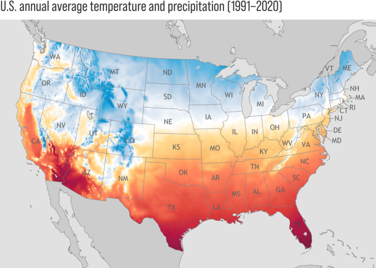
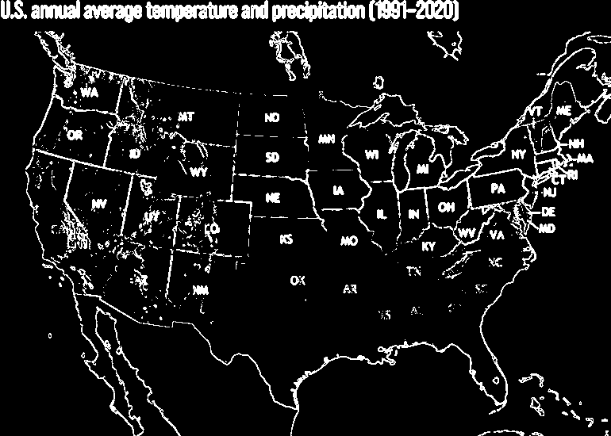
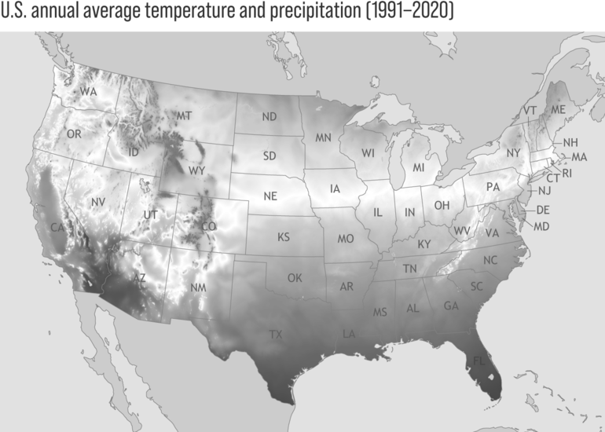

# ClassWork 00 For NeXT CS
### Class Period:
### Name0: YOUR NAME HERE
### Name1: TABLE_BUDDY NAME HERE
### Name2: TABLE_BUDY+ NAME HERE (if applicable, delete this line if not)
---

This is a map of average US temperatures from 1991-2020 [source](https://www.climate.gov/sites/default/files/2021-10/Normals_TotalPrecipAvgTemp_Annual_1991-2020_continuous_1400x2193.png)

Here is the same image after being processed by the edge detection algorithm discussed in class:

Here is the same image afger being translated to grayscale:

---

### Task 0

Based on the images above, answer the following questions.

#### Question 0
What parts of the original map are being highlighted by the edge detection algorithm?

YOUR ANSWER HERE (delete this line)

#### Question 1
What information that was part of the original image has been lost via edge detection?

YOUR ANSWER HERE (delete this line)

#### Question 2
What information is present in the grascale version that is not in the edge detected version?

YOUR ANSWER HERE (delete this line)

#### Question 3
What information that was part of the original image has been lost via grayscale conversion?

YOUR ANSWER HERE (delete this line)

#### Question 4
In a temperature map, it is often useful to highlight particular temperature ranges. If you wanted to focus on higher temperatures, you might want to find a way to programatically highlight regions that are more red than others. Come up with an algorithm that would process the image such that the red regions are more prominent.

YOUR ANSWER HERE (delete this line)

---

### TASK 1
This will involve adding code to _Detect.pde_. The file includes useful variables, `setup()` `draw()` `keypressed()` as well as a couple of potentially useful helper methods.

#### PART 0
In the _Detect.pde_ file you will find a method `PImage hightlightReds(PImage img)`. Write code for the algorithm you described above in that method. You may add other parameters, methods or variables if needed. The program is written so that pressing `h` will run the `highlightRed` method, and `r` will reset the image.

#### PART 1
Write the body of the `dots(PImage img, int resolution)` method as follows:
1. Every `resolution` pixels (in both x and y) draw a small circle (about half the size of the resolution is good).
2. The circle should be blue of the pixel is below a "significant" value, and red if it is above.
3. You can decided what is meant by significant red.

